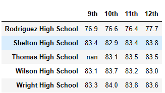

# School District Analysis with Panda

## Overview of the school district analysis

### Background

Pandas is a software library written for the Python programming language for data manipulation and analysis. For this, this project was developed using the software to complete operations for manipulating numerical tables and time series based on the School District Data. The school board has notified Maria and her supervisor that the students_complete.csv file shows evidence of academic dishonesty; specifically, reading and math grades for Thomas High School ninth graders appear to have been altered. 

### Purpose

The main purpose of this project is provide an overall analysis to uphold state-testing standards replacing the math and reading scores for Thomas High School with NaNs while keeping the rest of the data intact, and repeat the school district analysis to describe how these changes affected the overall analysis. 

## Replace ninth grade reading and math score - Results

To replace 9th grade reading and math scores at Thomas High Schools with NaN it was used the loc method on the original student data obtained after the development of the module, in order to select all the reading and math scores from 9th grade at Thomas High School using the following code (np.nan):

    student_data_df.loc[(student_data_df["school_name"] == "Thomas High School") & (student_data_df["grade"] == "9th"),"reading_score"] = np.nan

    student_data_df.loc[(student_data_df["school_name"] == "Thomas High School") & (student_data_df["grade"] == "9th"),"math_score"] = np.nan

The result obtained is show in the image below, where all the values for math and reading related with 9th grade at Thomas School were changed to NaN in order to complete further analysis:

## Repeating the School District Analysis - Results

The first step to complete the analysis was Combine the data into a single data set using the code below

    school_data_complete_df = pd.merge(student_data_df, school_data_df, how="left", on=["school_name", "school_name"])

Then, the calculation of the Total (Schools and Students) and Total Budget was required to further calculation and analysis to compare with the original results during the module. 

    school_count = len(school_data_complete_df["school_name"].unique())
    student_count = school_data_complete_df["Student ID"].count()
    total_budget = school_data_df["budget"].sum()

And the average scor using the "clean student data" after the substitution of scores for 9th grad at Thomas High School using the code:

    average_reading_score = school_data_complete_df["reading_score"].mean()
    average_math_score = school_data_complete_df["math_score"].mean()

Then, the total number of students in 9th grade at Thomas High Schools, which does not have grades was calculated. Then the total student count was calculate in order to subtract the number of students that are in ninth grade at Thomas High School from the total student count to get the new total student count using the code, obtaining a result of 38709 students, being the base for further code to redo the analysis as it was complete in the module.

### How is the district summary affected?
Analyzing the district summary before the change in the 9th grade for Thomas High School, it is possible observed that some changes were found for Average Score in Math 79 compared to 78.9, while the average scored for reading was the same (81.9). In the same way, the % Passing in Math went from 75% to 74.8% with a decreased of 0.26%. Same trend was observed for % Passing Reading, going from 86% to 85.7% (0.34%). Finally, the Overall Passing % has a decrease of 0.1 points from 65% to 64.9%. On the other side, value for total budget stayed the same as $24,649,428 as it is possible observe below:

District Summary Before

District Summary After

### How is the school summary affected?
Reviewing the Summary School Table it is possible verify changes in Overall Passing for THS from 90.94% to 90.63%. In the same way, % Passing Reading from 96.53% to 97.01% and % Passing Math from 93.13% to 93.27%. This changes are directly related with the elimination of the original scores related to 460 students from 9th grade in THS and having as a value nan in the data frame. 

School Summary Before

School Summary After

### How does replacing the ninth graders’ math and reading scores affect Thomas High School’s performance relative to the other schools?

Analyzing the Overall Passing Percentage, it is possible obtained a 90.94% between math and reading being in the top 5 schools with best index. After the calculation of the same metric after the modification of 9th grade, the THS has a overall passing percentage falled to 65.07% being located in the bottom 10 worse than schools like Holden High School (89.22%) or Shelton High School (89.89%) which originally were performing worse than THS. 

Overall % Passing Before

Overall % Passing After

### How does replacing the ninth-grade scores affect the following:

### Math and reading scores by grade
Analyzing the performance for math between 9th to 12th grades for Thomas High School; the average score for the school originally was around 83.42, while after took out the data for 9th grade, the average score for math was 83.36. In the same way, for reading average score between 9th to 12th grades went from 83.35 to 83.9. In the same way, the average score compared to other schools was affected significantly; having values a worse perfoance compare to schools like Wilson High School and Wright High School (with average for Reading of 84 and 83.97) or worse performace in math compare to Sheltom High School (Average score of 83.75) after the new Data Frame was generated. In the images below it is possible verify the perfomance by grande before and after the change in the data.

Math Scores By School Before

 

Math Scores By School After

Reading Scores By School Before 

Reading Scores By School After

### Scores by school spending
Analyzing scores by spending, it is possible to observe that Thomas High School is located in the range of $630-644, being the ranges affected by the modification in the data. In this way, % Overall Passing went from 62.85% to 62.77%. In the same way, % Passing for reading went from 84.39% to 84.31% and % Passing Math from 73.48% to 73.46%. About the averages scores, it was possible identified that reading went from 81.62 to 81.63 with a minimal change, while math went from 78.51 to 78.50 as average score affected by taking out the scores for 9th grade at Thomas High School. The summary for before and after could be found below, where it is possible state that other ranges were not affected by the new Data Frame:

Spending Before

Spending After

### Scores by school size
For the data related with Score by school size, it is possible observed that Thomas High Schools is located under the range od Medium School (1000-2000), being the range directly affected by the modification of the Data Frame. For this, the % Overall Passing went from 90.62 to 90.55, while % Passing Reading (from 96.79 to 96.73) and % Passing Math (93.59 to 93.58) where slightly affected. In the same way, the average sdcofe for Reading (from 83.86 to 83.87) and Manth (83.37 to 83.36) was affected as well when the comparission is made for all the schools in the Data Frame. More detail could be identify below, where also is possble affirm that Small and Large Range where not affected by the changes  

School by Size Before

School by Size After

### Scores by school type
Since the data that was refactored was related with the Thomas High School, which is a Charter as School Type, the values affected in the summary are related with this type of School. The % overall passing was affected with a reduction of 4.28% from 94.43% to 90.39%. In the same way, and increment in % Passing Reading of 2.28% (from 94.43% to 96.58%) and a decreased in % Passing Math from 96.61% to 93.62% in the recalculation. Additionally, the average score was affected with a increment of 0.52% for math as show the table below. Basically, a change in the results was obtanied to decrease the scores originally calculated for the Thomas High School (THS). It is important to mention that as showed before, a recalculation of the total students was made to ensure the data does not consider the poblation of students in the THS.

Original School Type Analysis
 

Refactored School Type Analysis 

## Summary

In summary, the changes of the 9th grade at Thomas High School have a direct affectation in the study when a comparission is made between the orginal study and the analysis developed during this project. Metrics as District and School Summary, Math and Reading Scores, Scores by spending, school size or school type are affected directly with the change of 460 students related with the school emntioned before. This action also, has a direct influence in the % Overall Performance and % Passion for Math and Reading, having Thomas High Schools with a worse performance compared to other Schools, while in the original data the values reflect a better performance locating THS in the top 10 Schools in the analysis. 

In the same way, changes are consequence of the new method of calculation where the total poblation of students went to 38,709 (460 less than the original count) affecting the average calculation.

Also, one of the most significant changes was the Overall Passing Percentage between math and reading combined, where metric went from 90.94% to 65.07% having a direct affectation for the performance of the school, being worse compare to Shelton High Schools, Wilson High School or Wright High School. 

### Conclusion 

In conclusion, about the new Data Frame created after the changes at Thomas Schools, it is possible affirmed that 9th grade originally represent an advantage to the school compared with other institutions when a perfromance measure was calculated. Also, the use of Pandas represent an advantage for the data manipulation to perform the analysis using similiar code compare to the original, having the data set related with 9th as NaN in order to complete the calculation require by the customer to obtain the analysis required for the 15 schools studied.

Finally, it is possible state that Pandas was the perfect tool to complete the data analysis and compare the performance of diferent metrics before and after the change of the grades related with math and reading for Thomas High School (9th grade). Some of the advantages include an easy representation of the data, and less writting in the code using the benefits of Pandas, having more flexibility in the programing working with Python.